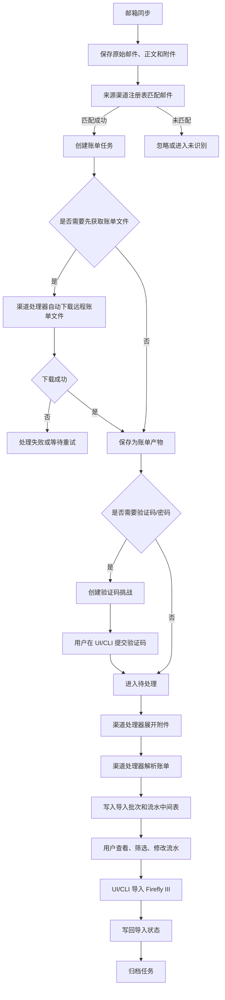

# 账单邮箱来源渠道架构规范

## 目标

账单邮箱系统按两层设计：

- 通用管道负责邮箱同步、邮件归档、任务状态、验证码挑战、附件/远程文件存储、事件日志、导入中间表、UI/API/CLI 操作和 Firefly III 导入。
- 来源渠道负责不同平台或银行自己的邮件识别、验证码策略、附件展开、账单解析、归档命名和字段映射。

这样后续添加微信、招商银行、中国银行等来源时，只新增渠道处理器，不改账单收件箱的主流程。

## 当前基准流程



## 通用管道职责

通用管道不能包含支付宝、微信或银行的业务细节。它只负责稳定生命周期：

- 读取用户邮箱配置并连接 IMAP/Gmail。
- 从所有已注册渠道收集邮箱搜索条件。
- 保存原始 `.eml`、正文文本、正文 HTML、附件、远程下载文件和派生文件。
- 基于 `BillSourceChannelRegistry` 匹配来源渠道。
- 创建 `bill_tasks`、`bill_artifacts`、`bill_secret_challenges`、`bill_task_events`。
- 维护任务状态：已接收、需要验证码、待处理、已解析、处理失败、已归档。
- 保存 `bill_statement_imports` 和 `bill_statement_rows`。
- 为渠道提供受控远程文件下载能力。通用管道只执行渠道确认过的下载请求，下载目标必须匹配渠道白名单域名和路径。
- 提供同一套 UI/API/CLI：查看任务、提交验证码、重试处理、下载已归档产物、筛选流水、编辑流水、导入 Firefly、归档任务。

## 来源渠道职责

每个来源渠道实现一个内置处理器。渠道只处理本来源差异：

- `source`：稳定来源标识，例如 `alipay`、`wechat`、`cmb`、`boc`。
- `profile_id`：同一来源下的账单类型，例如 `alipay-statement`、`cmb-credit-card`。
- 邮箱搜索条件：发件人、主题或后续支持的 label/keyword。
- 邮件匹配：判断邮件正文、链接和附件是否属于该渠道。
- 任务创建：写入渠道特定 summary、metadata、附件加密标记和远程文件获取信息。
- 远程文件获取：从邮件正文提取下载链接、判断有效期、限制下载域名、保存下载结果。
- 验证码策略：是否需要密码/验证码、提示文案、挑战类型。
- 附件展开：ZIP、CSV、XLSX、PDF、HTML 等。
- 账单解析：编码、表头、时间范围、行数据。
- 归档命名：`来源平台-导出时间-账单范围`。
- Firefly 草稿映射：收支类型、账户名、分类、备注、标签。

## 后端扩展契约

渠道处理器通过 `BillSourceChannel` 接口接入：

```php
interface BillSourceChannel
{
    public function source(): string;
    public function profileIds(): array;
    public function mailboxSearchCriteria(): array;
    public function matches(BillMailMessage $mail, array $attachments): bool;
    public function ingest(BillMailMessage $mail, array $attachments): BillTask;
    public function prepare(BillTask $task): bool;
    public function needsSecret(BillTask $task): bool;
    public function secretPrompt(BillTask $task): string;
    public function process(BillTask $task, ?string $secret = null): bool;
    public function shouldProcessAfterSecret(BillTask $task): bool;
}
```

`BillSourceChannelRegistry` 负责：

- 注册所有内置渠道。
- 给邮箱同步层提供搜索条件。
- 给邮件入库层匹配渠道。
- 给任务处理层按 `source + profile_id` 找到处理器。

`prepare()` 是渠道的预处理阶段，必须可重复执行。支付宝这类邮件附件已到位的渠道可以 no-op；微信这类邮件正文包含下载链接的渠道必须在这里自动下载账单文件并写入 `bill_artifacts`。如果远程文件下载失败、链接过期或域名不在白名单中，任务进入处理失败或等待重试状态，不创建验证码挑战。

## 支付宝渠道规范

当前支付宝渠道作为第一个内置渠道：

- 来源：`alipay`
- 类型：`alipay-statement`
- 邮件搜索：`FROM "service@mail.alipay.com"`
- 邮件识别：发件人为 `service@mail.alipay.com` 且主题包含 `支付宝交易流水明细`
- 附件：加密 ZIP
- 验证码提示：`请输入支付宝服务消息中的账单解压密码`
- 解压后读取 CSV，编码按 UTF-8/GB18030/GBK/BIG5 自动识别，默认兼容 GB18030
- 表头识别字段包括：交易时间、交易分类、交易对方、金额、收/支、收/付款方式、交易订单号
- 归档文件名：`alipay-YYYYMMDDHHmm-YYYYMMDD_YYYYMMDD.csv`
- 支出映射：付款方式作为 source，交易对方作为 destination，类型 `withdrawal`
- 收入映射：交易对方作为 source，收款方式作为 destination，类型 `deposit`
- 不计收支默认不自动导入，保留在中间表等待用户修改

## 微信支付渠道规范

微信支付渠道使用邮件正文里的官方下载链接获取账单文件，不需要用户手动点击下载：

- 来源：`wechat`
- 类型：`wechat-pay-statement`
- 邮件搜索：`FROM "wechatpay@tencent.com"`
- 邮件识别：发件人为 `wechatpay@tencent.com`，主题或正文包含 `微信支付账单流水文件`
- 正文识别：正文包含账期，例如 `微信支付账单流水文件(20260515-20260615)`，并包含 `点击下载`、`7天内有效`
- 下载链接：只允许 `https://tenpay.wechatpay.cn/userroll/userbilldownload/downloadfilefromemail`，参数中必须包含 `encrypted_file_data`
- 文件获取：邮箱同步识别到任务后，渠道处理器自动下载加密账单文件并保存为 `bill_artifacts`
- 附件：远程下载得到的加密 ZIP 或平台返回的加密账单文件
- 验证码提示：`请输入微信支付公众号收到的账单解压密码`
- 密码来源：微信支付公众号发送给申请人微信
- 解压后按微信支付自己的流水结构解析，不能复用支付宝字段映射。微信常见导出文件是 XLSX，表头字段包括：交易时间、交易类型、交易对方、商品、收/支、金额(元)、支付方式、当前状态、交易单号、商户单号、备注
- XLSX 解析需要读取工作表和 shared strings，并把 Excel 日期序列转换为 Asia/Shanghai 本地时间
- 下载失败：链接过期、域名不匹配、HTTP 失败或文件为空时，任务标记为处理失败并记录可读失败原因；UI/CLI 提供重试处理入口
- 归档文件名：`wechat-pay-YYYYMMDDHHmm-YYYYMMDD_YYYYMMDD.csv` 或 `wechat-pay-YYYYMMDDHHmm-YYYYMMDD_YYYYMMDD.xlsx`
- 解压并解析到导入中间表后，用户在 UI/CLI 中确认再存入 Firefly 交易

微信支付渠道不得在 UI/CLI 展示完整下载链接或 `encrypted_file_data`。这些令牌只作为后端自动下载上下文使用；下载成功后，用户只看到任务来源、账期、状态、产物和下一步操作。

## 招商银行交易流水渠道规范

招商银行交易流水渠道第一版先覆盖邮箱识别、加密 ZIP 保存、验证码挑战和解压归档。解压后的表格结构需要等真实样本确认后，再补解析器和 Firefly 字段映射：

- 来源：`cmb`
- 类型：`cmb-transaction-statement`
- 邮件搜索：`FROM "95555@message.cmbchina.com"`
- 邮件识别：发件人为 `95555@message.cmbchina.com`，主题包含 `招商银行交易流水`，正文包含 `招商银行App`、`流水打印` 或邮件带 ZIP 附件
- 正文识别：邮件正文会说明“通过招商银行App申请的电子版交易流水”，并提示从 `招商银行App-流水打印-申请记录` 查询解压码
- 申请时间：从正文里的 `YYYY年MM月DD日HH:mm:ss` 提取，保存到任务 metadata 的 `applied_at`
- 附件：邮件直接携带加密 ZIP；附件名可能在邮箱客户端里乱码，渠道不能依赖附件名匹配，只能把后缀作为文件类型参考
- 验证码提示：`请输入招商银行App“流水打印-申请记录”中的账单解压码`
- 密码来源：招商银行 App 的流水打印申请记录
- 解压产物：解压出的 CSV/XLS/XLSX/PDF/TXT 等文件保存为派生 artifact，metadata.source 标记为 `cmb_zip_extract`
- 当前解析状态：第一版不写入 `bill_statement_imports` / `bill_statement_rows`，因为真实解压文件结构还未确认；任务会记录 `parser_status=waiting_for_sample_structure`
- 后续解析要求：拿到真实解压文件后，新增招商专用 import service，识别表头、账期、导出时间、收支方向、交易对方、金额、账户、摘要和订单号，再写入中间表

招商渠道不得复用支付宝或微信支付的 CSV/XLSX 字段映射。招商银行是银行流水，字段语义、账户方向和金额正负规则都必须单独确认。

## 远程下载规则

部分来源不会把账单作为邮件附件发送，而是把限时下载链接放在邮件正文里。通用管道必须支持这种来源，但下载规则由渠道声明：

- 渠道负责从正文 HTML/text 中提取候选链接，并判断该链接是否属于本渠道。
- 渠道必须声明允许下载的协议、域名、路径和必要参数。
- 通用管道只下载渠道确认过的链接，不跟随邮件中的其它链接。
- 下载动作在后端自动完成，不能要求用户手动打开邮件链接。
- 下载后的原始文件必须写入 `bill_artifacts`，`metadata.source` 标记为 `remote_download`。
- 失败事件必须记录可读原因，例如链接过期、下载失败、文件为空、域名不匹配。
- UI/CLI 可以提供重试任务入口，但不展示完整签名链接、令牌或敏感查询参数。

## 新增来源流程

新增微信、招商银行、中国银行时按这个顺序做：

1. 保存真实样本邮件、正文、附件或远程下载文件到测试 fixture。
2. 新增一个渠道类，例如 `WechatBillSourceChannel`、`CmbBillSourceChannel`。
3. 实现 `source()`、`profileIds()`、`mailboxSearchCriteria()`、`matches()`。
4. 实现任务创建，把附件加密、来源摘要、metadata、账期和远程文件上下文写准确。
5. 实现 `prepare()`：附件型渠道可以 no-op；下载链接型渠道必须自动下载账单文件并写入产物。
6. 实现验证码策略，不在任务表保存明文密码。
7. 实现附件展开和解析服务，解析结果写入导入批次和流水中间表。
8. 实现 Firefly 草稿字段映射。
9. 在注册表中注册渠道。
10. 加测试覆盖搜索条件、邮件匹配、远程下载、验证码、解析行数、归档文件名、重复处理不重复写行。
11. 确认 UI/API/CLI 不需要新增专用入口，只使用通用账单工作台。

## UI/CLI 约束

- 用户界面展示中文状态：需要验证码、已解析、已归档、处理失败。
- 不展示 raw status，例如 `needs_secret`、`parsed`、`cleaned`。
- 不展示解释密码明文处理方式的小字。安全策略放在工程文档和代码里，不放在用户操作界面。
- UI 和 CLI 都操作同一套 API 和数据库，不维护自己的任务状态。
- 归档只隐藏/标记任务，不删除邮件、附件和解析文件。
- 对远程下载型渠道，UI/CLI 展示下载状态和失败原因，但不要求用户手动打开邮件下载链接。
- UI/CLI 不展示完整下载 URL、签名令牌或敏感查询参数。

## 数据源规则

中间表是账单处理依据：

- `bill_statement_imports` 表示一份账单文件或导入批次。
- `bill_statement_rows` 表示一条可编辑流水。
- 原始数据保留在 `raw_data`。
- 用户可改字段保留在结构化字段和 `editable_data`。
- Firefly 导入草稿字段可被 UI/CLI 修改。
- 导入成功后写回 `transaction_group_id` 和导入状态。

第一版不做已有 Firefly 交易匹配。查重和智能匹配后续作为独立能力添加。
