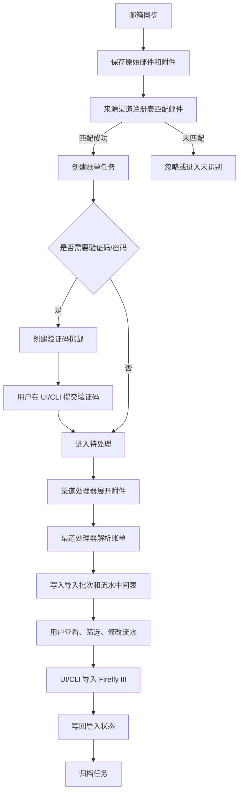

# 账单邮箱来源渠道架构规范

## 目标

账单邮箱系统按两层设计：

- 通用管道负责邮箱同步、邮件归档、任务状态、验证码挑战、附件存储、事件日志、导入中间表、UI/API/CLI 操作和 Firefly III 导入。
- 来源渠道负责不同平台或银行自己的邮件识别、验证码策略、附件展开、账单解析、归档命名和字段映射。

这样后续添加微信、招商银行、中国银行等来源时，只新增渠道处理器，不改账单收件箱的主流程。

## 当前基准流程



## 通用管道职责

通用管道不能包含支付宝、微信或银行的业务细节。它只负责稳定生命周期：

- 读取用户邮箱配置并连接 IMAP/Gmail。
- 从所有已注册渠道收集邮箱搜索条件。
- 保存原始 `.eml`、附件和派生文件。
- 基于 `BillSourceChannelRegistry` 匹配来源渠道。
- 创建 `bill_tasks`、`bill_artifacts`、`bill_secret_challenges`、`bill_task_events`。
- 维护任务状态：已接收、需要验证码、待处理、已解析、处理失败、已归档。
- 保存 `bill_statement_imports` 和 `bill_statement_rows`。
- 提供同一套 UI/API/CLI：查看任务、提交验证码、下载附件、筛选流水、编辑流水、导入 Firefly、归档任务。

## 来源渠道职责

每个来源渠道实现一个内置处理器。渠道只处理本来源差异：

- `source`：稳定来源标识，例如 `alipay`、`wechat`、`cmb`、`boc`。
- `profile_id`：同一来源下的账单类型，例如 `alipay-statement`、`cmb-credit-card`。
- 邮箱搜索条件：发件人、主题或后续支持的 label/keyword。
- 邮件匹配：判断邮件和附件是否属于该渠道。
- 任务创建：写入渠道特定 summary、metadata、附件加密标记。
- 验证码策略：是否需要密码/验证码、提示文案、挑战类型。
- 附件展开：ZIP、CSV、XLSX、PDF、HTML 等。
- 账单解析：编码、表头、时间范围、行数据。
- 归档命名：`来源平台-导出时间-账单范围`。
- Firefly 草稿映射：收支类型、账户名、分类、备注、标签。

## 后端扩展契约

渠道处理器通过 `BillSourceChannel` 接口接入：

```php
interface BillSourceChannel
{
    public function source(): string;
    public function profileIds(): array;
    public function mailboxSearchCriteria(): array;
    public function matches(BillMailMessage $mail, array $attachments): bool;
    public function ingest(BillMailMessage $mail, array $attachments): BillTask;
    public function needsSecret(BillTask $task): bool;
    public function secretPrompt(BillTask $task): string;
    public function process(BillTask $task, ?string $secret = null): bool;
    public function shouldProcessAfterSecret(BillTask $task): bool;
}
```

`BillSourceChannelRegistry` 负责：

- 注册所有内置渠道。
- 给邮箱同步层提供搜索条件。
- 给邮件入库层匹配渠道。
- 给任务处理层按 `source + profile_id` 找到处理器。

## 支付宝渠道规范

当前支付宝渠道作为第一个内置渠道：

- 来源：`alipay`
- 类型：`alipay-statement`
- 邮件搜索：`FROM "service@mail.alipay.com"`
- 邮件识别：发件人为 `service@mail.alipay.com` 且主题包含 `支付宝交易流水明细`
- 附件：加密 ZIP
- 验证码提示：`请输入支付宝服务消息中的账单解压密码`
- 解压后读取 CSV，编码按 UTF-8/GB18030/GBK/BIG5 自动识别，默认兼容 GB18030
- 表头识别字段包括：交易时间、交易分类、交易对方、金额、收/支、收/付款方式、交易订单号
- 归档文件名：`alipay-YYYYMMDDHHmm-YYYYMMDD_YYYYMMDD.csv`
- 支出映射：付款方式作为 source，交易对方作为 destination，类型 `withdrawal`
- 收入映射：交易对方作为 source，收款方式作为 destination，类型 `deposit`
- 不计收支默认不自动导入，保留在中间表等待用户修改

## 新增来源流程

新增微信、招商银行、中国银行时按这个顺序做：

1. 保存真实样本邮件和附件到测试 fixture。
2. 新增一个渠道类，例如 `WechatBillSourceChannel`、`CmbBillSourceChannel`。
3. 实现 `source()`、`profileIds()`、`mailboxSearchCriteria()`、`matches()`。
4. 实现任务创建，把附件加密、来源摘要、metadata 写准确。
5. 实现验证码策略，不在任务表保存明文密码。
6. 实现附件展开和解析服务，解析结果写入导入批次和流水中间表。
7. 实现 Firefly 草稿字段映射。
8. 在注册表中注册渠道。
9. 加测试覆盖搜索条件、邮件匹配、验证码、解析行数、归档文件名、重复处理不重复写行。
10. 确认 UI/API/CLI 不需要新增专用入口，只使用通用账单工作台。

## UI/CLI 约束

- 用户界面展示中文状态：需要验证码、已解析、已归档、处理失败。
- 不展示 raw status，例如 `needs_secret`、`parsed`、`cleaned`。
- 不展示解释密码明文处理方式的小字。安全策略放在工程文档和代码里，不放在用户操作界面。
- UI 和 CLI 都操作同一套 API 和数据库，不维护自己的任务状态。
- 归档只隐藏/标记任务，不删除邮件、附件和解析文件。

## 数据源规则

中间表是账单处理依据：

- `bill_statement_imports` 表示一份账单文件或导入批次。
- `bill_statement_rows` 表示一条可编辑流水。
- 原始数据保留在 `raw_data`。
- 用户可改字段保留在结构化字段和 `editable_data`。
- Firefly 导入草稿字段可被 UI/CLI 修改。
- 导入成功后写回 `transaction_group_id` 和导入状态。

第一版不做已有 Firefly 交易匹配。查重和智能匹配后续作为独立能力添加。
