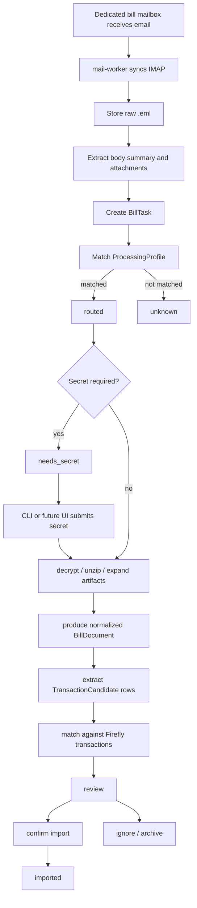

# Bill Ingestion Workflow

## Goal

Build a generic bill ingestion workflow before implementing any specific Alipay, WeChat, or bank parser.

The project will use a dedicated bill mailbox as an incoming-only channel. Banks, payment platforms, or the user send bill emails to this mailbox. The project does not send bill export requests. It only receives, archives, tracks, decrypts when needed, parses when a source processor exists, compares with Firefly III, and prepares confirmed imports.

## Product Boundary

Firefly III remains the accounting backend.

The bill ingestion layer owns:

- IMAP mailbox sync
- raw email and attachment archiving
- task creation and status transitions
- source/profile routing
- password or verification-code challenges
- normalized artifacts and parser outputs
- transaction candidates
- matching candidates against Firefly III transactions
- CLI inspection and manual workflow controls

Source-specific processors are separate from the common workflow. Alipay, WeChat, CMB, or other bank logic should plug into the same task model later.

## Non-Goals For The First Version

- Do not trigger bill exports from banks or platforms.
- Do not implement full Alipay, WeChat, or bank parsing yet.
- Do not build a UI yet.
- Do not import automatically without review.
- Do not store plaintext secrets longer than needed for the current task attempt.

## High-Level Flow



## Task States

- `received`: email metadata was seen.
- `archived`: raw email and original attachments were stored.
- `routed`: a processing profile matched the email or artifact.
- `unknown`: no profile matched; manual classification is needed.
- `needs_secret`: the task requires a password or verification code.
- `ready`: the task has enough information to process.
- `processing`: a worker is processing the task.
- `parsed`: the processor produced normalized bill data.
- `matched`: transaction candidates were compared with Firefly III.
- `review`: the task is waiting for human confirmation.
- `imported`: confirmed candidates were imported.
- `ignored`: the user chose not to process this task.
- `failed`: processing failed and can be inspected or retried.

State transitions should be append-only in an event log so an AI agent and user can audit what happened.

## Core Data Model

### MailMessage

- `id`
- `messageId`
- `mailbox`
- `from`
- `to`
- `subject`
- `receivedAt`
- `rawPath`
- `bodyTextPath`
- `bodyHtmlPath`
- `checksum`
- `syncCursor`

### BillTask

- `id`
- `mailMessageId`
- `source`: `alipay | wechat | cmb | unknown | ...`
- `profileId`
- `status`
- `receivedAt`
- `summary`
- `currentChallengeId`
- `errorCode`
- `errorMessage`

### BillArtifact

- `id`
- `taskId`
- `kind`: `eml | html | text | csv | xlsx | zip | pdf | image | json | other`
- `filename`
- `path`
- `checksum`
- `encrypted`
- `derivedFromArtifactId`
- `metadata`

### ProcessingProfile

- `id`
- `source`
- `displayName`
- `matchRules`
- `artifactRules`
- `secretPolicy`
- `processor`

Example:

```yaml
id: cmb-credit-card
source: cmb
displayName: 招商银行信用卡账单
matchRules:
  from:
    - "*@cmbchina.com"
  subjectIncludes:
    - "电子账单"
artifactRules:
  prefer:
    - zip
    - xlsx
secretPolicy:
  required: true
  kind: password
processor:
  type: profile
  name: cmb-credit-card-xlsx
```

### SecretChallenge

- `id`
- `taskId`
- `kind`: `password | code`
- `prompt`
- `status`: `open | consumed | failed | cancelled`
- `attempts`
- `createdAt`
- `consumedAt`

Secrets should be supplied through CLI or future UI at processing time. The system should not persist the plaintext secret unless a later explicit encrypted secret store is designed.

### BillDocument

- `id`
- `taskId`
- `source`
- `periodStart`
- `periodEnd`
- `accountHint`
- `currency`
- `metadata`
- `documentPath`

### TransactionCandidate

- `id`
- `taskId`
- `billDocumentId`
- `date`
- `amount`
- `type`
- `merchant`
- `accountHint`
- `description`
- `categoryHint`
- `raw`
- `matchStatus`: `new | duplicate | ambiguous | ignored | imported`
- `matchedFireflyTransactionIds`

## Storage Layout

Use project-owned local storage outside the Firefly III tree.

Suggested default:

```text
firefly-cli-data/
  inbox.db
  mail/
    raw/<mail-id>.eml
    body/<mail-id>.txt
    body/<mail-id>.html
  artifacts/
    original/<task-id>/
    derived/<task-id>/
  parsed/
    <task-id>.json
  logs/
```

The exact default path should be configurable, for example:

- `FIREFLY_BILLS_DATA_DIR`
- `--data-dir <path>`

## CLI Surface

First version should focus on visibility and manual progression.

```bash
ffc bill-inbox sync
ffc bill-inbox list
ffc bill-inbox show <taskId>
ffc bill-inbox artifacts <taskId>
ffc bill-inbox events <taskId>
ffc bill-inbox secret submit <taskId> --value <password>
ffc bill-inbox route <taskId> --profile <profileId>
ffc bill-inbox retry <taskId>
ffc bill-inbox parse <taskId>
ffc bill-inbox candidates <taskId>
ffc bill-inbox match <taskId>
ffc bill-inbox import <taskId> --confirm
ffc bill-inbox ignore <taskId>
```

The AI agent should be able to inspect every stage with JSON output:

```bash
ffc bill-inbox list --format json
ffc bill-inbox show <taskId> --format json
ffc bill-inbox candidates <taskId> --format json
```

## Processing Profile Contract

Profiles should be declarative where possible and executable only at the processor boundary.

Each profile answers:

- Which emails does this profile match?
- Which artifacts should be selected?
- Is a password or code required?
- What derived files should be produced?
- Which parser turns derived files into normalized bill documents and transaction candidates?

Unknown sources must remain first-class. If no profile matches, the task should not fail; it should enter `unknown` and be available for manual classification.

## Error Handling

Common failures:

- IMAP authentication failed
- message already processed
- attachment missing
- unsupported artifact type
- encrypted artifact needs secret
- secret failed
- parser failed
- no transaction candidates found
- Firefly comparison failed
- import failed

Every failure should:

- set task status to `failed` or `needs_secret`
- append an event
- preserve raw artifacts
- be inspectable through CLI
- support retry when safe

## Security Notes

- Use a dedicated mailbox that receives only bill emails.
- Store mailbox credentials in the existing config system or a dedicated local encrypted config later.
- Never log passwords or verification codes.
- Prefer temporary plaintext secret handling.
- Preserve original files for audit, but make the storage path explicit because bill emails contain sensitive financial data.
- Add a future cleanup/export policy before long-term use.

## Implementation Plan

### Phase 1: Generic Task Store And CLI

Goal: create inspectable local task management without IMAP.

- Add local `inbox.db` or JSON-backed store abstraction.
- Add `BillTask`, `MailMessage`, `BillArtifact`, `SecretChallenge`, and event records.
- Add CLI:
  - `ffc bill-inbox list`
  - `ffc bill-inbox show <taskId>`
  - `ffc bill-inbox artifacts <taskId>`
  - `ffc bill-inbox events <taskId>`
  - `ffc bill-inbox secret submit <taskId> --value <password>`
  - `ffc bill-inbox retry <taskId>`
  - `ffc bill-inbox ignore <taskId>`
- Add tests around state transitions and JSON output.

### Phase 2: IMAP Sync And Archiving

Goal: connect the dedicated mailbox and create tasks.

- Add IMAP configuration.
- Implement `ffc bill-inbox sync`.
- Fetch new messages idempotently by message id/checksum.
- Store raw `.eml`, body text/html, and original attachments.
- Create `BillTask` records in `archived` state.
- Add event log entries for every sync decision.

### Phase 3: Profile Routing

Goal: route tasks without parsing source-specific bill formats.

- Add profile config loader.
- Implement match rules for sender, subject, body snippets, attachment names, and artifact types.
- Move matched tasks to `routed` or `needs_secret`.
- Move unmatched tasks to `unknown`.
- Add CLI `ffc bill-inbox route <taskId> --profile <profileId>`.

### Phase 4: Secret Challenge And Artifact Expansion

Goal: support encrypted zip/xlsx workflows generically.

- Model `SecretChallenge`.
- Add CLI secret submission.
- Use submitted secret to run profile-defined decrypt/unzip steps.
- Store derived artifacts separately from originals.
- Append success/failure events.

### Phase 5: Parser Adapter Contract

Goal: allow source-specific processors to plug in later.

- Define parser input/output JSON contract.
- Add a no-op parser for tests.
- Add `ffc bill-inbox parse <taskId>`.
- Store `BillDocument` and `TransactionCandidate` JSON.

### Phase 6: Firefly Matching And Import

Goal: reuse existing transaction import matching concepts.

- Compare candidates with Firefly transactions by date, amount, merchant, and account hints.
- Add `ffc bill-inbox candidates <taskId>`.
- Add `ffc bill-inbox match <taskId>`.
- Add `ffc bill-inbox import <taskId> --confirm`.

## Open Design Questions

- Should the task store be SQLite from the beginning or start with JSON files?
- Where should local sensitive data live by default?
- Should mailbox sync be a CLI command only at first, or should a daemon entrypoint be included?
- Should profile configs live in repo, user config, or both?
- How should future UI share the same task store and secret challenge flow?
